# Guardian API Contract

Status: Gate 0 revision for Claude re-review

Contract version: `guardian-api-v1`

Last updated: 2026-08-05

This document freezes the iOS/backend boundary before Guardian Mode implementation. It incorporates
the P0/P1 findings in `Docs/CLAUDE_FINISH_REVIEW.md`. Gate 1 remains blocked until Claude re-reviews
this revision and the founders accept the human-dependency decisions.

## Architecture decision

Guardian v1 uses relationship-scoped public-key capabilities, not accounts or Sign in with Apple.
It does not use D1.

- The screened person's app creates a P-256 signing key when it starts a relationship. The private
  key stays in Keychain-backed device storage; Secure Enclave is used where available.
- The guardian's app creates a separate key when redeeming the invite.
- The Worker stores only public keys and verifies a signature on every relationship mutation.
- One `GuardianRelationship` Durable Object owns the relationship, both public keys, consent,
  revocation, device registrations, verified phone digests, alert state, provider transitions,
  acknowledgment, alarms, and retention for that relationship.
- Revocation and alert submission therefore serialize through the same object. No remote database
  read can race the decision to notify.
- Loss of either device requires revocation by the other party and a fresh invite. Guardian v1 has
  no account recovery or multi-device continuity. Those features are the future trigger to evaluate
  an additive identity layer.

The current shared-token founder SMS endpoint remains isolated during Gate 0. It must be removed
before any guardian receives a distributed build. No Guardian endpoint accepts the app-wide shared
token.

## Safety and privacy invariants

- The API accepts alerts only for a live `SIGNALS_DETECTED` result. Samples,
  `INCONCLUSIVE`, and `NO_SIGNALS_DETECTED` are never alertable.
- Alerts contain no score, task metric, camera detail, inferred substance, diagnosis, BAC estimate,
  or safe-to-drive statement.
- The server creates notification text from a versioned template. Clients cannot submit arbitrary
  message bodies.
- APNs or Twilio acceptance means accepted for sending only. Neither means delivered, seen, or
  acted upon.
- Only a valid guardian-key signature covering the relationship, event, action, and request time can
  produce `guardianAcknowledged`.
- Every screening alert starts with one client-generated UUID persisted before the first request.
  Push, fallback, callback, polling, retry, and relaunch retain the canonical event ID returned by
  the server.
- A repeated concerning event may coalesce into an already-active alert, but never silently fails.
  The response names the canonical active event and the app keeps direct help actions prominent.
- Samples and research archives never contain relationship, capability, guardian-device, alert, or
  provider identifiers.
- Logs follow `Docs/GUARDIAN_DATA_GOVERNANCE.md`.

## Protocol conventions

- Base path: `/v1`
- Content type: `application/json; charset=utf-8`, except the Twilio form callback.
- JSON keys: `camelCase`.
- Dates: UTC RFC 3339 with fractional seconds.
- Resource IDs: opaque strings with type prefixes. Clients must not parse them.
- Alert event IDs: canonical lowercase UUID strings.
- Mutating requests use `Idempotency-Key`; reuse with changed canonical content returns
  `409 idempotencyConflict`.
- Responses use `Cache-Control: no-store`; authenticated requests require TLS.
- Clients ignore unknown response fields. Unknown enum values decode to explicit `unknown`, never
  success.

Errors use one non-enumerating envelope:

```json
{
  "error": {
    "code": "invalidRequest",
    "message": "The request could not be completed.",
    "retryable": false
  },
  "requestId": "req_01k1..."
}
```

The privacy-safe `requestId` is present on every response.

## Relationship capability signatures

Each role has one capability ID and one P-256 public key. The private key is non-exportable when the
device supports Secure Enclave and is otherwise stored with `kSecAttrAccessibleAfterFirstUnlockThisDeviceOnly`.
The simulator fallback is founder-testing-only.

Signed requests include:

```text
Sober-Relationship-ID: rel_01k1...
Sober-Capability-ID: rcap_01k1...
Sober-Timestamp: 2026-08-05T18:48:00.123Z
Sober-Nonce: <base64url 128-bit random value>
Sober-Signature: <base64url ES256 signature>
```

The signature covers the UTF-8 bytes of:

```text
guardian-api-v1
<HTTP method>
<normalized path, with no query string>
<lowercase SHA-256 hex of the exact body bytes, or empty-body hash>
<Sober-Relationship-ID>
<Sober-Capability-ID>
<Sober-Timestamp>
<Sober-Nonce>
<Idempotency-Key or empty string>
```

The ES256 signature is the 64-byte `r || s` form before base64url encoding. The relationship object
rejects a capability with the wrong role, a timestamp outside five minutes, a reused nonce in the
ten-minute replay window, an expired/revoked relationship, or an invalid signature. Those failures
all return `404 notFound` after the request shape is validated.

The acknowledgment body includes `action: helping`, while the path includes the exact event ID; both
are therefore signed. A bearer token cannot create an acknowledgment.

## Consent versions

| Consent ID | Accepted by | Purpose |
| --- | --- | --- |
| `guardian-sender-v1` | Screened person | Create one relationship and send minimal help requests |
| `person-phone-verification-v1` | Screened person | Verify a self phone solely to reject same-phone guardians |
| `guardian-recipient-v1` | Guardian | Accept the relationship and acknowledgment responsibility |
| `notification-disclosure-v1` | Guardian | Confirm provider acceptance is not delivery and configure notifications |
| `guardian-sms-fallback-v1` | Guardian | Verify one fallback number and permit minimal fallback SMS messages |

Consent is an affirmative, timestamped action. It is never inferred from permission, invite use, or
a preselected switch. A material consent update changes the relationship to
`reauthorizationRequired`; new automatic alerts stop until both affected current versions are
signed. Call, Message, and Ride actions remain available.

## Relationship creation and person verification

Relationship states are `pendingPersonVerification`, `pendingGuardian`, `active`,
`reauthorizationRequired`, `revoked`, and `expired`. Only `active` can alert.

### `POST /v1/guardian-relationships`

Creates an inert relationship and sends a code to the screened person's own phone. This endpoint is
not capability-authenticated because the relationship does not exist yet. The founder build accepts
only configured allowlisted self-phone digests plus strict per-phone-digest and network abuse limits.
Abuse-limiter unavailability fails closed before any SMS. Removing the allowlist requires a separate
reviewed App Attest or equivalent enrollment contract and is blocked for v1.

```json
{
  "personPublicKeyJwk": {
    "kty": "EC",
    "crv": "P-256",
    "x": "<base64url>",
    "y": "<base64url>"
  },
  "personDisplayName": "Vinay",
  "personSelfPhone": "+13125550111",
  "senderConsentVersion": "guardian-sender-v1",
  "phoneConsentVersion": "person-phone-verification-v1"
}
```

The display label is limited to 80 Unicode scalar values; control characters and links are
rejected. The phone is normalized in memory. Its ciphertext exists only for the ten-minute code
challenge; the active relationship retains only its keyed digest for same-phone rejection.

```json
{
  "relationshipId": "rel_01k1...",
  "personCapabilityId": "rcap_01k1...",
  "challengeId": "gphv_01k1...",
  "maskedPhone": "+1 ••• ••• 0111",
  "state": "pendingPersonVerification",
  "challengeExpiresAt": "2026-08-05T18:58:00.123Z",
  "relationshipExpiresAt": "2026-08-05T19:08:00.123Z",
  "requestId": "req_01k1..."
}
```

The challenge permits five attempts and expires after ten minutes. An unverified relationship
expires after twenty minutes and cannot register a device or send an alert.

### `PUT /v1/guardian-relationships/{relationshipId}/person-phone/challenges/{challengeId}`

Requires the person capability signature and an `Idempotency-Key`.

```json
{
  "code": "123456"
}
```

Success consumes the challenge, deletes the encrypted self phone, stores only its keyed digest,
changes the relationship to `pendingGuardian`, and returns the invite exactly once:

```json
{
  "relationshipId": "rel_01k1...",
  "state": "pendingGuardian",
  "inviteUrl": "https://sober.example/guardian/invite/rel_01k1.../<single-use-token>",
  "inviteExpiresAt": "2026-08-06T18:49:00.000Z",
  "requestId": "req_01k1..."
}
```

The invite token has at least 128 bits of entropy, expires after 24 hours, and is stored only as a
keyed hash. Wrong, expired, exhausted, replayed, or mismatched codes return the same
`422 verificationFailed` response.

## Guardian redemption

### `POST /v1/guardian-relationships/{relationshipId}/redeem`

Requires the single-use invite token but no existing capability signature.

```json
{
  "inviteToken": "<single-use-token>",
  "guardianPublicKeyJwk": {
    "kty": "EC",
    "crv": "P-256",
    "x": "<base64url>",
    "y": "<base64url>"
  },
  "guardianConsentVersion": "guardian-recipient-v1",
  "notificationDisclosureVersion": "notification-disclosure-v1",
  "differentPersonAttestation": true
}
```

The Durable Object atomically checks the invite, rejects a guardian public key equal to the person
key, consumes the token, stores the guardian public key, and activates the relationship. Expired,
used, revoked, malformed, wrong-relationship, or same-key tokens all return `404 invalidInvite`.

```json
{
  "relationship": {
    "relationshipId": "rel_01k1...",
    "guardianCapabilityId": "rcap_01k2...",
    "personDisplayName": "Vinay",
    "state": "active",
    "activatedAt": "2026-08-05T18:51:02.011Z",
    "expiresAt": "2026-11-03T18:51:02.011Z"
  },
  "requestId": "req_01k1..."
}
```

Guardian v1 relationships expire after 90 days and require a fresh two-sided invite. There is no
silent renewal, key recovery, or multi-device enrollment.

## Relationship state and revocation

- `GET /v1/guardian-relationships/{relationshipId}` requires either valid capability and returns
  the caller-appropriate view. The screened person never receives the guardian's phone, masked
  phone, device token, public key, or capability ID. The person view includes only
  `guardianReachability: pushEligible`, `fallbackOnly`, `unavailable`, or `unknown` so a stale or
  uninstalled guardian app cannot leave a falsely reassuring Home state.
- `PUT /v1/guardian-relationships/{relationshipId}/consents/{consentId}` records only the calling
  role's signed acceptance.
- `DELETE /v1/guardian-relationships/{relationshipId}` requires either role capability and is
  idempotent.

Revocation is committed inside the same object and lock that submits alerts. Ordering is exact:

1. If revocation commits before alert reservation, the alert is rejected and no provider is called.
2. If alert reservation acquires the object lock first, that already-started provider attempt may
   finish; revocation cannot recall an external request. No fallback starts after revocation.
3. The revoking party receives success only after state is durable.
4. The other role's registered device receives a generic `relationshipChanged` push containing the
   opaque relationship ID needed for signed reconciliation. Whether or not
   that push is accepted, the app rechecks relationship state on foreground and immediately returns
   its Home/Safety Circle UI to unconfigured.

Capability, relationship, and alert existence errors are generic to prevent enumeration.

## APNs registration

Both roles may register one device so the guardian can receive alerts and the person can receive
relationship-change notices. Registration requires current consent and a role capability signature.

### `PUT /v1/guardian-relationships/{relationshipId}/devices/{role}`

```json
{
  "installationId": "<random Keychain value>",
  "deviceToken": "<base64url APNs token bytes>",
  "environment": "sandbox",
  "bundleId": "com.soberprototype.app",
  "notificationAuthorization": "authorized",
  "registeredAt": "2026-08-05T18:52:11.000Z"
}
```

The signed role must match `{role}` (`person` or `guardian`). APNs tokens are variable-length; no
fixed count is assumed. Valid authorization states are `authorized`, `provisional`, and `ephemeral`.
`denied` and `notDetermined` make the device ineligible.

The object encrypts each token and stores a keyed digest for uniqueness. Re-registration atomically
replaces the prior token. `DELETE` on the same path deletes it on logout, permission revocation,
relationship revocation, or local reset. APNs `410` invalidates it.

Guardian alerts use `apns-priority: 10` and `interruption-level: time-sensitive`. If Apple grants
the Critical Alerts entitlement and the guardian explicitly enables it, the reviewed production
profile may use `critical`; ordinary builds must never claim to bypass every Focus mode. APNs
acceptance remains only provider acceptance in all profiles.

## Guardian SMS fallback verification

Redeeming an invite does not inherit an unverified Safety Circle number. The guardian separately
verifies a fallback phone and accepts `guardian-sms-fallback-v1`.

### `POST /v1/guardian-relationships/{relationshipId}/fallback-phone/challenges`

Requires the guardian capability signature and `Idempotency-Key`.

```json
{
  "phone": "+13125550123",
  "consentVersion": "guardian-sms-fallback-v1"
}
```

The Worker normalizes the phone in memory and asks a phone-keyed `AbuseLimiter` Durable Object for
one verification reservation. Limiter unavailability fails closed. Inside the relationship object,
the keyed phone digest is compared with the verified person's self-phone digest; equality returns
`422 samePersonNotAllowed` before an SMS is sent.

The code challenge expires after ten minutes and permits five attempts. The raw code is never
stored; the phone is encrypted only while the challenge is active.

### `PUT /v1/guardian-relationships/{relationshipId}/fallback-phone/challenges/{challengeId}`

Requires the guardian signature and a body containing the code. Success atomically activates the
new phone, invalidates the prior phone and pending challenges, and returns `verified` without
returning the number. Failed cases return generic `422 verificationFailed`.

`DELETE /v1/guardian-relationships/{relationshipId}/fallback-phone` immediately makes fallback
ineligible and schedules ciphertext deletion within 24 hours.

## Alert creation, coalescing, and status

### `PUT /v1/guardian-relationships/{relationshipId}/alerts/{eventId}`

Requires the person capability signature and an `Idempotency-Key` equal to `eventId`.

```json
{
  "occurredAt": "2026-08-05T18:55:00.000Z",
  "result": "SIGNALS_DETECTED",
  "source": "liveCheck",
  "messageTemplateVersion": "guardian-help-v1"
}
```

The decoder rejects unknown sensitive fields such as `score`, `metrics`, `substance`, `camera`,
`message`, `phone`, and `providerReference`. Only the exact live concerning pair is alertable.

The object first checks relationship state and consent, then idempotency. It persists the event and
one 30-second fallback alarm before calling APNs. This pre-provider write is the durable boundary.

If an unacknowledged canonical alert already exists from the prior ten minutes with the same
relationship, result, source, and message template, a new event is durably recorded as an alias of
that alert. No second push or SMS is sent. The response uses `uiState: alertAlreadyActive` and
returns `canonicalEventId`. Retries and SMS fallback for a canonical event consume no additional
rate reservation. There is no fixed three-alert limiter on signed active relationships.

The first canonical event returns `202`; an identical replay or alias returns `200`. Reuse of an
event ID with changed canonical content returns `409 idempotencyConflict`.

### `GET /v1/guardian-relationships/{relationshipId}/alerts/{eventId}`

Either role capability can query status. An alias resolves to the canonical event but retains both
IDs in the response:

```json
{
  "alert": {
    "requestedEventId": "5c275a44-ea12-4e6d-9f73-d5f72e837a55",
    "canonicalEventId": "5c275a44-ea12-4e6d-9f73-d5f72e837a55",
    "workflowState": "fallbackScheduled",
    "uiState": "pushAccepted",
    "version": 4,
    "createdAt": "2026-08-05T18:55:00.100Z",
    "updatedAt": "2026-08-05T18:55:00.350Z",
    "expiresAt": "2026-08-06T18:55:00.100Z",
    "push": {
      "state": "accepted",
      "acceptedAt": "2026-08-05T18:55:00.340Z"
    },
    "fallback": {
      "state": "scheduled",
      "availability": "verified",
      "scheduledFor": "2026-08-05T18:55:30.100Z"
    },
    "sms": {
      "state": "notAttempted"
    },
    "guardian": {
      "acknowledgedAt": null
    },
    "nextPollAfterMilliseconds": 2000
  },
  "requestId": "req_01k1..."
}
```

No provider reference, recipient address, or guardian-open timestamp is returned to the screened
person. `version` increases on every durable transition. iOS ignores a response older than the last
applied version.

### State vocabulary

`workflowState` is internal reconciliation state:

- `reserved`: event, fingerprint, and fallback alarm are durable before provider contact.
- `pushAccepted`: APNs accepted at least one request; delivery is unconfirmed.
- `fallbackScheduled`: APNs accepted and the existing alarm remains armed.
- `pushRejected`: no eligible device or every APNs request was definitively rejected.
- `smsAccepted`: Twilio accepted the fallback request; delivery is unconfirmed.
- `guardianAcknowledged`: a valid guardian signature acknowledged help.
- `statusUnknown`: a provider may have accepted but the server cannot prove the outcome.
- `expired`: 24-hour status ended.

Guardian open is optional privacy-safe telemetry (`openedAt`) used for debugging. It is not a
workflow milestone, is not returned to the screened person, and never changes screened-person copy.

Nested states:

- `push.state`: `notAttempted`, `accepted`, `rejected`, `unknown`.
- `fallback.state`: `notScheduled`, `scheduled`, `cancelled`, `fired`.
- `fallback.availability`: `verified`, `unavailable`, `revoked`.
- `sms.state`: `notAttempted`, `accepted`, `sent`, `delivered`, `undelivered`, `failed`, `unknown`.

Screened-person `uiState` values:

- `alerting`: no provider acceptance is proven yet.
- `alertAlreadyActive`: a recent unacknowledged canonical alert remains active; no duplicate sent.
- `pushAccepted`: APNs accepted for sending; delivery and viewing are unconfirmed.
- `smsFallbackAccepted`: Twilio accepted for sending; delivery and viewing are unconfirmed.
- `guardianAcknowledged`: a signed acknowledgment was accepted.
- `failed`: attempted automatic routes definitively failed or no eligible route exists.
- `statusUnknown`: provider outcome or durable reconstruction is uncertain.
- `expired`: status expired without acknowledgment.

There is no screened-person `guardianOpened` or `delivered` state.

## Alert transitions

```mermaid
stateDiagram-v2
  [*] --> reserved: persist event + fingerprint + 30s alarm
  reserved --> pushAccepted: APNs accepts
  pushAccepted --> fallbackScheduled: retain armed alarm
  reserved --> pushRejected: no device / definitive rejection
  pushRejected --> smsAccepted: verified immediate fallback accepted
  fallbackScheduled --> smsAccepted: alarm fires without acknowledgment
  reserved --> statusUnknown: APNs outcome uncertain; alarm stays armed
  pushRejected --> statusUnknown: SMS outcome uncertain
  fallbackScheduled --> statusUnknown: fallback outcome uncertain
  reserved --> guardianAcknowledged: valid guardian signature
  pushAccepted --> guardianAcknowledged: valid guardian signature
  fallbackScheduled --> guardianAcknowledged: atomically cancel alarm
  smsAccepted --> guardianAcknowledged: valid guardian signature
  statusUnknown --> guardianAcknowledged: valid guardian signature
  reserved --> expired: 24h
  pushRejected --> expired: 24h
  fallbackScheduled --> expired: 24h
  smsAccepted --> expired: 24h
  guardianAcknowledged --> expired: 24h
  statusUnknown --> expired: 24h
```



Transition rules:

1. The alarm exists before APNs contact. APNs timeout or post-response storage ambiguity cannot lose
   the one fallback opportunity.
2. No eligible device or definitive APNs rejection attempts verified SMS immediately.
3. APNs acceptance keeps the alarm scheduled for 30 seconds after durable event reservation.
4. A guardian open never cancels fallback. Only signed acknowledgment cancels it.
5. Acknowledgment at the alarm boundary and alarm execution serialize in the same object. Whichever
   mutation acquires the lock first wins; exactly one fallback attempt can occur.
6. Once fallback fires, acknowledgment cannot retract the external request.
7. Provider uncertainty never retries the same channel automatically. SMS uncertainty in particular
   suppresses another SMS to avoid duplicates.
8. A verified fallback phone and current SMS consent are required. Otherwise
   `fallback.availability` is `unavailable`, UI is truthful, and direct help remains prominent.
9. Durable Object unavailability results in no new provider attempt. iOS uses the same event ID to
   reconcile later and shows `statusUnknown` plus direct help in the meantime.
10. Relationship revocation follows the ordering contract above and prevents all later alarms,
    sends, opens, and acknowledgments.

## Guardian open and acknowledgment

The push payload contains only the opaque relationship ID, canonical event UUID, a non-sensitive
route code, and generic help text. Relationship context is fetched after signature authentication.

- `PUT .../alerts/{eventId}/opened` requires the guardian signature. It records telemetry only and
  does not cancel fallback.
- `PUT .../alerts/{eventId}/acknowledgment` requires the guardian signature and body
  `{ "action": "helping" }`. The signed path and body bind the action to the event.

Exact acknowledgment replays return the existing state. Wrong role, revoked relationship, expired
event, alias mismatch, or invalid signature returns generic `404 notFound`. Only the backend's
`guardianAcknowledged` response may produce acknowledgment copy in the person's app.

## APNs and SMS provider handling

APNs responses are classified as accepted, definitive rejection, retry-safe-before-send, or
unknown-after-send. Raw response bodies and tokens are never logged. APNs `410` invalidates the
device. APNs `429` and `5xx` do not create provider-acceptance copy; the armed fallback remains.

`POST /v1/provider-callbacks/twilio/status/{relationshipId}/{eventId}/{callbackToken}` accepts
form-encoded Twilio callbacks and validates the provider signature against the exact public URL and
fields. The opaque relationship ID routes directly to its Durable Object; the object checks the
event, keyed callback-token hash, and keyed provider-message-ID hash before mutation. Valid
`queued`, `sent`, `delivered`, `undelivered`, and `failed` values update `sms.state`; replays are
idempotent and regressions are ignored. SMS delivery remains transport evidence only. Callback URLs
and raw path parameters are excluded from logs.

Provider message IDs are keyed digests used for callback lookup and are not returned or logged.

## Dependency fail directions

| Failure point | Required behavior |
| --- | --- |
| Relationship/alert write before provider contact | Call no provider; return retryable failure and reuse the same ID |
| Alarm persistence before APNs | Call no provider; return retryable failure so fallback cannot be lost |
| APNs credential/signing failure | Mark push rejected and attempt one verified SMS immediately |
| APNs timeout or post-send state-write failure | Mark/retain push unknown, keep the pre-existing alarm, never retry APNs automatically |
| No push device or definitive APNs rejection | Atomically fire the existing alarm early, then attempt one verified SMS |
| SMS timeout or post-send state-write failure | Mark SMS unknown and never retry SMS automatically |
| Definitive SMS rejection before acceptance | Mark failed; show direct help, with no delivery/acknowledgment claim |
| Encryption/decryption failure for a provider token | Treat that route as unavailable, emit a privacy-safe security event, and use only another verified route |
| Phone abuse limiter unavailable | Send no verification code and return retryable setup failure |
| Verification SMS outcome uncertain | Keep one challenge/code active, do not send a second code automatically, and tell the user it may be arriving |
| Twilio callback state write unavailable | Return non-2xx so Twilio may replay the signed callback; do not change person-facing truth |
| Revocation notification push fails | Revocation still succeeds; the person's next foreground sync must show unconfigured |
| Entire relationship object unavailable | Start no new provider work; clients show local status unknown/direct help and reconcile with the same IDs |

A dependency never converts absence or uncertainty into provider acceptance, delivery, human opening,
or acknowledgment.

## HTTP and retry behavior

| Status | Meaning |
| --- | --- |
| `200` | Read, exact replay, alias/coalesced event, or already-applied transition |
| `201` | Inert relationship created |
| `202` | Canonical alert durably reserved; provider delivery is not implied |
| `204` | Idempotent revocation/deletion completed |
| `400` | Invalid JSON or malformed request |
| `404` | Invalid capability/signature or resource unavailable to this caller |
| `409` | Idempotency or state-precondition conflict |
| `422` | Non-alertable result, invalid consent, same-person setup, or failed verification |
| `425` | A provider submission may have succeeded; do not retry that channel |
| `429` | Setup/verification abuse limit; never a silent alert outcome |
| `500` | Internal failure before any provider ambiguity |
| `503` | Dependency unavailable; retry only when the envelope says `retryable: true` |

Clients retry only network failures, `408`, setup/verification `429`, and explicitly retryable `5xx`
using backoff, jitter, and the same idempotency key. After an alert timeout they first query the
event. `425`, provider `unknown`, and corrupt local receipt stop automatic sends and surface direct
help.

## Required shared fixtures

- relationship creation, self-phone challenge, expiry, and attempt exhaustion;
- invite activation, replay, same public key, wrong relationship, and 24-hour expiry;
- capability signature success, wrong role, body mutation, event mutation, stale timestamp, and
  nonce replay;
- verified same-phone guardian rejection and different-phone activation;
- APNs registration, rotation, `410`, permission denial, time-sensitive payload, and revocation;
- canonical alert creation, exact replay, fingerprint conflict, alias/coalescing, and fallback with
  no second reservation;
- every workflow, nested transport, and screened-person UI state;
- guardian open with no person-facing state change;
- signed acknowledgment before, during, and after alarm execution;
- revocation immediately before and after alert reservation;
- APNs timeout/rejection/`410`/`429`/`5xx`, SMS uncertainty, and Durable Object unavailability;
- Twilio callback success, replay, regression, and signature forgery;
- relationship-change notification plus foreground reconciliation;
- proof that research export contains no Guardian identifiers.

Any field, signature input, retention period, state, or transition change requires a contract-version
update and both-owner review before implementation.
